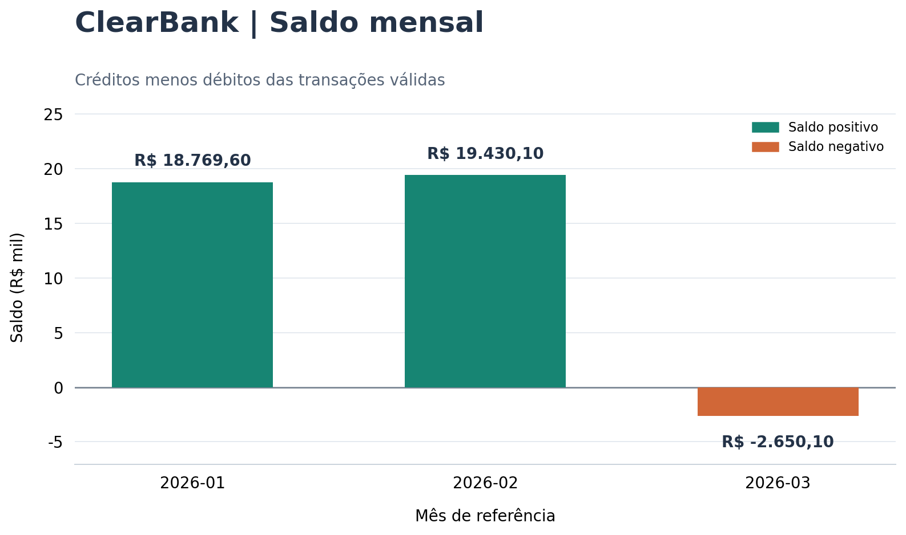

# Análise Financeira com Python - ClearBank

[Abrir o notebook no Google Colab](https://colab.research.google.com/github/JILiraJr/clearbank-analise/blob/main/desafio-final.ipynb)

Solução do desafio prático: um notebook que lê e valida transações bancárias,
calcula indicadores financeiros mensais, sinaliza transações acima de
R$ 10.000,00, exibe um relatório formatado e exporta os resultados para JSON.
Os dados utilizados são **fictícios**.

O fluxo principal usa apenas a biblioteca padrão do Python, incluindo
`csv.DictReader`, `datetime`, funções, estruturas de repetição e `try/except`.
Os dois requisitos opcionais também estão implementados: leitura e agrupamento
com pandas em arquivo separado e gráfico de saldo mensal com matplotlib.

## Arquivos

```text
clearbank-analise/
├── desafio-final.ipynb          # Implementação, testes e saídas executadas
├── transacoes.csv              # Base criada manualmente antes da execução
├── relatorio.json              # Relatório exportado pelo notebook
├── analise_pandas.py            # Opcional R01: read_csv e groupby
├── grafico.png                 # Opcional R02: barras do saldo mensal
├── README.md
├── requirements.txt            # Dependências dos dois opcionais
├── requirements-dev.txt        # Dependências da execução e auditoria automática
└── scripts/
    └── verificar_entrega.py     # Executa em kernel novo e salva as saídas
```

## Como executar

Requer **Python 3.10 ou superior**. O CSV e `analise_pandas.py` devem estar na
mesma pasta do notebook. A parte principal não requer bibliotecas externas.

### Google Colab

1. Abra `desafio-final.ipynb` no Google Colab.
2. Na aba **Arquivos**, envie `transacoes.csv` e `analise_pandas.py`.
3. Se as bibliotecas opcionais não estiverem disponíveis, execute
   `%pip install pandas matplotlib` em uma célula temporária.
4. Use **Ambiente de execução → Executar tudo**.
5. Salve ou baixe o notebook **com as saídas**. Os arquivos `relatorio.json` e
   `grafico.png` serão gerados na pasta de trabalho.

### Jupyter local

Instale os extras no ambiente do seu Jupyter:

```bash
python -m pip install -r requirements.txt
```

Abra `desafio-final.ipynb`, escolha um kernel Python 3.10 ou superior e execute
**todas as células em ordem**. Salve o notebook depois da execução.

### Execução e auditoria automática

Esta opção executa o notebook inteiro em um kernel novo, sem abrir uma interface,
e salva o `.ipynb` com suas saídas reais:

```bash
python3 -m venv .venv
source .venv/bin/activate
python -m pip install -r requirements-dev.txt
python scripts/verificar_entrega.py
```

No Windows, substitua a ativação por `.venv\Scripts\activate`.

## Dados e regras de validação

O arquivo `transacoes.csv` tem as colunas
`id,data,cliente_id,tipo,valor,descricao,categoria` e **33 registros**:

- 18 transações válidas distribuídas em 3 meses, com 6 transações por mês.
- 14 registros com campos inválidos e 1 ID duplicado, totalizando 15 descartes.
- 2 transações com valores acima de R$ 10.000,00.
- 1 transação de R$ 10.000,00 exatos, que não deve ser marcada como suspeita.

A validação descarta silenciosamente IDs vazios ou não inteiros, clientes vazios,
datas fora de `AAAA-MM-DD` ou inexistentes, tipos diferentes de `credito`/`debito`
e valores não numéricos, não finitos, iguais a zero ou negativos. Espaços externos
são removidos. `descricao` e `categoria` são preservadas; não há regra adicional
para descartar uma transação somente por esses campos estarem vazios.

Como o cenário menciona duplicatas e o ID deve identificar uma transação única,
a primeira ocorrência **válida** de cada ID é mantida. As seguintes são
contadas como inválidas e também aparecem no total de duplicatas. Uma ocorrência
inválida anterior não impede a aceitação de uma transação válida do mesmo ID.

## Resultados da base fornecida

Período analisado: **2026-01-05 a 2026-03-31**, com **85 dias** entre os extremos.
A média corresponde à soma de todos os valores do mês dividida pela quantidade
de transações, considerando créditos e débitos como valores positivos.

| Mês | Quantidade | Crédito | Débito | Saldo | Média | Maior valor | Menor valor |
| --- | ---: | ---: | ---: | ---: | ---: | ---: | ---: |
| 2026-01 | 6 | R$ 20.300,00 | R$ 1.530,40 | R$ 18.769,60 | R$ 3.638,40 | R$ 12.000,00 | R$ 180,50 |
| 2026-02 | 6 | R$ 20.700,00 | R$ 1.269,90 | R$ 19.430,10 | R$ 3.661,65 | R$ 15.000,00 | R$ 99,90 |
| 2026-03 | 6 | R$ 8.200,10 | R$ 10.850,20 | R$ -2.650,10 | R$ 3.175,05 | R$ 10.000,00 | R$ 0,10 |

Suspeitas: **ID 5**, de R$ 12.000,00, e **ID 10**, de R$ 15.000,00.
A regra é estritamente `valor > LIMITE_SUSPEITO`, com `LIMITE_SUSPEITO = 10000.00`.
Essa sinalização permite revisão posterior e não é uma conclusão sobre fraude.

Os valores são convertidos para `float`, como pedido. Os cálculos usam
`Decimal(str(valor))` para evitar erros de acumulação de centavos, com
arredondamento `ROUND_HALF_UP` a duas casas na saída. O terminal usa o padrão
brasileiro, enquanto o JSON armazena números, sem o prefixo monetário.

### Saídas geradas

- `relatorio.json`: data de geração, contagens, duplicatas, período, resumo
  mensal e lista de suspeitas com `id`, `cliente_id`, `data` e `valor`.
- `grafico.png`: gráfico de barras do saldo mensal, com título, rótulos nos
  eixos, legenda e valores em reais.
- Saída da célula principal: relatório com separadores, período, quantidade
  de linhas válidas e inválidas, sete métricas mensais e transações suspeitas.
- Saída opcional com pandas: tabela mensal e confirmação de igualdade com
  **todos os campos** do relatório nativo.

`gerado_em` registra a data da execução. As demais métricas são reproduzíveis
para a mesma base de entrada.



## Requisitos e verificação

| Requisito | Onde verificar |
| --- | --- |
| CSV nativo com DictReader e arquivo ausente tratado | Seção 2 do notebook |
| Validação e resumo da limpeza | Seções 3 e 4 |
| Pelo menos quatro funções separadas | 12 funções na solução principal |
| datetime, mês e diferença em dias | Seções 3, 5 e 6 |
| Sete métricas financeiras por mês | Seção 6 |
| Constante e identificação de suspeitas | Seções 1 e 6 |
| Exportação em relatorio.json | Seção 7 e execução principal |
| try/except em três situações distintas | Leitura do CSV, conversão de valor e conversão de data |
| Relatório formatado na saída da célula | Seções 8 e 9 |
| Opcional R01: pandas separado e resultados iguais | Seção 10 e analise_pandas.py |
| Opcional R02: matplotlib e grafico.png | Seção 11 |
| Todas as células executadas e saídas visíveis | Notebook salvo e auditoria automática |

Os testes visíveis no notebook verificam leitura por nomes, BOM, vírgula em
campo entre aspas, cabeçalhos, arquivo ausente, validação silenciosa, ano
bissexto, duplicatas, ordem das datas, sete métricas, centavos, limite exato,
ausência de suspeitas, JSON com acentos, erro de escrita e base sem válidas.

A auditoria automática confere a sintaxe para Python 3.10, a estrutura do
notebook, todas as células executadas em ordem com saídas e sem erros, os
arquivos gerados e uma **segunda base independente** com outro ano e outros
valores. Também compara pandas com a solução nativa nessa segunda base.

Os testes internos usam uma amostra fixa em memória. A execução principal aceita
outras bases com a mesma estrutura sem exigir as contagens da demonstração.
A auditoria também executa **o notebook inteiro** com outro CSV, somente linhas
inválidas, apenas o cabeçalho, arquivo ausente, cabeçalho incorreto e uma base
sem suspeitas. Cada cenário precisa executar as 12 células sem erro.
